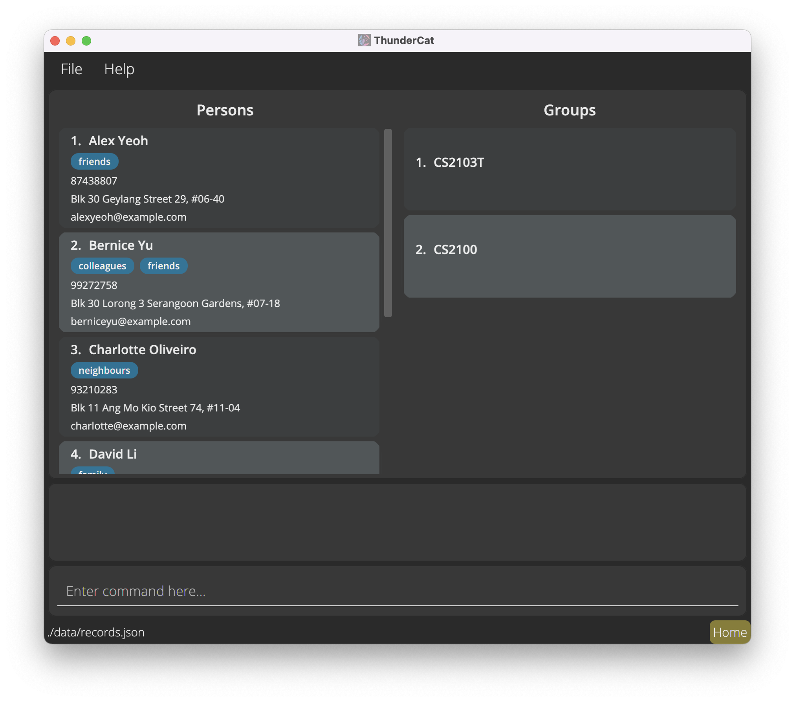

Thundercat (TC) is a **desktop app for managing contacts, optimized for use via a Command Line Interface** (CLI) while still having the benefits of a Graphical User Interface (GUI). If you can type fast, TC can get your contact management tasks done faster than traditional GUI apps.

* Table of Contents
{:toc}

--------------------------------------------------------------------------------------------------------------------

## Quick start

1. Ensure you have Java `11` or above installed in your Computer.

1. Download the latest `thundercat.jar` from [here](https://github.com/AY2122S1-CS2103T-W17-3/tp/releases).

1. Copy the file to the folder you want to use as the _home folder_ for your thundercat.

1. Double-click the file to start the app. The GUI similar to the below should appear in a few seconds. Note how the app contains some sample data. 
   

1. Type the command in the command box and press Enter to execute it. e.g. typing **`help`** and pressing Enter will open the help window. 
   Some example commands you can try:

   * **`list`** : Lists all contacts.

   * **`add`**`n/John Doe p/98765432 e/johnd@example.com a/John street, block 123, #01-01` : Adds a contact named `John Doe` to the Thundercat.

   * **`delete`**`3` : Deletes the 3rd contact shown in the current list.

   * **`clear`** : Deletes all contacts.

   * **`exit`** : Exits the app.

1. Refer to the [Features](#features) below for details of each command.

--------------------------------------------------------------------------------------------------------------------

## Features

**:information_source: Notes about the command format:** 

* Words in `UPPER_CASE` are the parameters to be supplied by the user. 
  e.g. in `add n/NAME`, `NAME` is a parameter which can be used as `add n/John Doe`.

* Items in square brackets are optional. 
  e.g `n/NAME [t/TAG]` can be used as `n/John Doe t/friend` or as `n/John Doe`.

* Items with `…`​ after them can be used multiple times including zero times. 
  e.g. `[t/TAG]…​` can be used as ` ` (i.e. 0 times), `t/friend`, `t/friend t/family` etc.

* Parameters can be in any order. 
  e.g. if the command specifies `n/NAME p/PHONE_NUMBER`, `p/PHONE_NUMBER n/NAME` is also acceptable.

* If a parameter is expected only once in the command but you specified it multiple times, only the last occurrence of the parameter will be taken. 
  e.g. if you specify `p/12341234 p/56785678`, only `p/56785678` will be taken.

* Extraneous parameters for commands that do not take in parameters (such as `help`, `list`, `exit` and `clear`) will be ignored. 
  e.g. if the command specifies `help 123`, it will be interpreted as `help`.

### Viewing help : `help`

Shows a message explaning how to access the help page.

Format: `help`

### Adding a person: `add`

Adds a person to the Thundercat.

Format: `add n/NAME p/PHONE_NUMBER e/EMAIL a/ADDRESS [t/TAG]…​`

:bulb: **Tip:**
A person can have any number of tags (including 0)

Examples:
* `add n/John Doe p/98765432 e/johnd@example.com a/John street, block 123, #01-01`
* `add n/Betsy Crowe t/friend e/betsycrowe@example.com a/Newgate Prison p/1234567 t/criminal`

### Creating a group : `group`

Creates a group in Thundercat.

Format: `group g/GROUP_NAME`

Examples:  
* `group g/CS2103 Project Group`
* `group g/Family`

### Viewing all groups: `groups`

List all groups in Thundercat.

Format: `groups`

### Listing all persons : `list`

Shows a list of all persons in the Thundercat.

Format: `list`

### Editing a person : `edit`

Edits an existing person in the Thundercat.

Format: `edit INDEX [n/NAME] [p/PHONE] [e/EMAIL] [a/ADDRESS] [t/TAG]…​`

* Edits the person at the specified `INDEX`. The index refers to the index number shown in the displayed person list. The index **must be a positive integer** 1, 2, 3, …​
* At least one of the optional fields must be provided.
* Existing values will be updated to the input values.
* When editing tags, the existing tags of the person will be removed i.e adding of tags is not cumulative.
* You can remove all the person’s tags by typing `t/` without
    specifying any tags after it.

Examples:
*  `edit 1 p/91234567 e/johndoe@example.com` Edits the phone number and email address of the 1st person to be `91234567` and `johndoe@example.com` respectively.
*  `edit 2 n/Betsy Crower t/` Edits the name of the 2nd person to be `Betsy Crower` and clears all existing tags.

### Locating persons by name: `find`

Finds persons whose names contain any of the given keywords.

Format: `find KEYWORD [MORE_KEYWORDS]`

* The search is case-insensitive. e.g `hans` will match `Hans`
* The order of the keywords does not matter. e.g. `Hans Bo` will match `Bo Hans`
* Only the name is searched.
* Only full words will be matched e.g. `Han` will not match `Hans`
* Persons matching at least one keyword will be returned (i.e. `OR` search).
  e.g. `Hans Bo` will return `Hans Gruber`, `Bo Yang`

Examples:
* `find John` returns `john` and `John Doe`
* `find alex david` returns `Alex Yeoh`, `David Li` 
  

### Deleting a person : `delete` [update coming soon]

Deletes the specified person from the Thundercat (removes all groups related to this contact automatically).

Format: `delete INDEX`

* Deletes the person at the specified `INDEX` and removes it from all related groups automatically.
* The index refers to the index number shown in the displayed person list.
* The index **must be a positive integer** 1, 2, 3, …​

Examples:
* `list` followed by `delete 2` deletes the 2nd person in the Thundercat.
* `find Betsy` followed by `delete 1` deletes the 1st person in the results of the `find` command.

### Deleting a group : `deleteG` [coming soon]

Deletes a specified group from the Thundercat.

Format: `deleteG g/GROUP_INDEX`

* Deletes the group at the specified `GROUP_INDEX`.
* The group index refers to the group number shown in the displayed group list.
* The index **must be a positive integer** 1, 2, 3, …​

Examples:
* `groups` followed by `deleteG g/2` deletes the 2nd group in the Thundercat.

### Adding multiple people to a group : `addG` [coming soon]

Adds multiple specified people to a specified group.

Format: `addG PERSON_INDEX_1, PERSON_INDEX_2, …​ g/GROUP_INDEX`

* Adds to a group specified at `GROUP_INDEX`, multiple people specified at `PERSON_INDEX_1, PERSON_INDEX_2, …​`
* The group index refers to the group number shown in the displayed group list.
* The person index refers to the person index number show in the displayed person list.
* Group index **must be a positive integer** 1, 2, 3, …​
* Person index **must be a positive integer** 1, 2, 3, …​

Examples:
* `groups` followed by `list` and finally `addG 1,2,3 g/2` adds the persons indexed 1, 2 and 
  3 to the group indexed 2.
  
### Adding a person to multiple groups: `join`

Adds a person to a list of groups.

Format: `join PERSON_INDEX g/GROUP_INDEX_1[,GROUP_INDEX_2]...`

* The person at the specified `PERSON_INDEX` is set to join all the group(s) at the specified `GROUP_INDEX_1`,
`GROUP_INDEX_2`, etc.
* The `PERSON_INDEX` refers to the index number shown in the last displayed person list.
* `GROUP_INDEX_1`, `GROUP_INDEX_2`, etc. refer to the index numbers shown in the last displayed group list.
* The indices **must all be positive integers** 1, 2, 3, …​

Examples:
* `join 1 g/2`
* `join 2 g/1,3,6,8`

### Listing all group mates in a group: `mates`

Lists out all the group mates in a group.

Format: `mates GROUP_INDEX`

* The group mates in the group at the specified `GROUP_INDEX` are listed out.
* The `GROUP_INDEX` refers to the index number shown in the last displayed group list.
* The index **must be a positive integer** 1, 2, 3, …​

Example:
* `mates 7`

### Clearing all entries : `clear`

Clears all entries from the Thundercat.

Format: `clear`

### Exiting the program : `exit`

Exits the program.

Format: `exit`

### Saving the data

Thundercat data are saved in the hard disk automatically after any command that changes the data. There is no need to save manually.

### Editing the data file

Thundercat data are saved as a JSON file `[JAR file location]/data/thundercat.json`. Advanced users are welcome to update data directly by editing that data file.

:exclamation: **Caution:**
If your changes to the data file makes its format invalid, Thundercat will discard all data and start with an empty data file at the next run.

### Archiving data files `[coming in v2.0]`

_Details coming soon ..._

--------------------------------------------------------------------------------------------------------------------

## FAQ

**Q**: How do I transfer my data to another Computer? 
**A**: Install the app in the other computer and overwrite the empty data file it creates with the file that contains the data of your previous Thundercat home folder.

--------------------------------------------------------------------------------------------------------------------

## Command summary

Action | Format | Examples
--------|---------|---------
**Add contact** | `add n/NAME p/PHONE_NUMBER e/EMAIL a/ADDRESS [t/TAG]…​` | `add n/James Ho p/22224444 e/jamesho@example.com a/123, Clementi Rd, 1234665 t/friend t/colleague`
**Clear all** | `clear`
**Delete contact** | `delete INDEX` | `delete 3`
**Edit contact** | `edit INDEX [n/NAME] [p/PHONE_NUMBER] [e/EMAIL] [a/ADDRESS] [t/TAG]…​`|`edit 2 n/James Lee e/jameslee@example.com`
**Find contact** | `find KEYWORD [MORE_KEYWORDS]` | `find James Jake`
**List all contacts** | `list`
**Create Group** | `group GROUP_NAME` | `group CS2103 Project Group`
**Show all Groups** | `groups`
**Delete Group** | `deleteG g/GROUP_INDEX` | `deleteG g/2`
**Adding people to Group** | `addG PERSON_INDEX_1, PERSON_INDEX_2.. g/GROUP_INDEX` |`addG 1, 2, 3 g/2`
**Join Person to Groups** | `join PERSON_INDEX g/GROUP_INDEX_1[,GROUP_INDEX_2]...` | `join 2 g/1,3,6,8`
**Show all people in Group** | `mates GROUP_INDEX` | `mates 7`
**Destroy** | `destroy GROUP_INDEX` | `destroy 2`
**Help** | `help`
